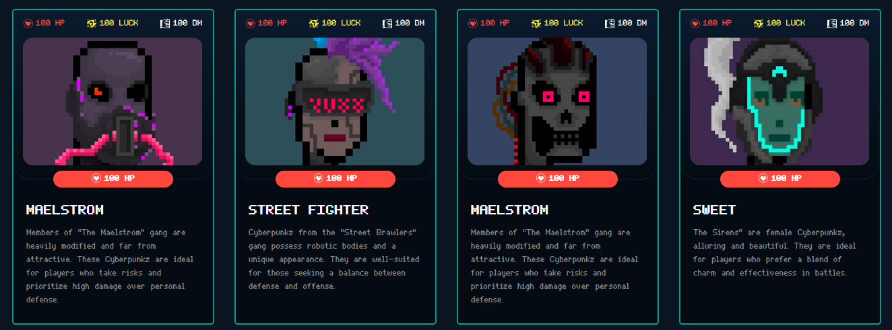
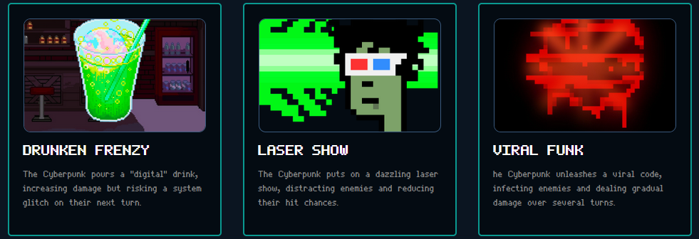
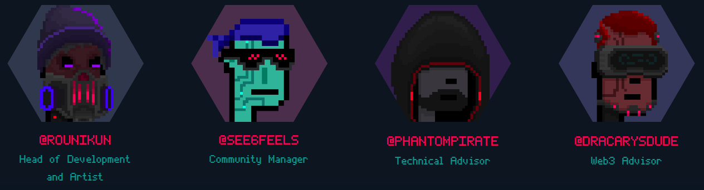

 

  

  <h3 align="center">CyberPunks 2088 Game</h3>

  

    Solana play-to-earn card game with CyberPunks at Night City!
     
     
    <a href="https://github.com/CyberpunksTeam/cyberpunks-2088-game">Download</a>
    ·
    <a href="https://github.com/CyberpunksTeam/cyberpunks-2088-game">Twitter</a>
    ·
    <a href="https://github.com/CyberpunksTeam/cyberpunks-2088-game">Discord</a>
  

## Introduction
Welcome to CyberPunks2088 Game, a thrilling dive into the world of cyberpunks where each decision holds significance. Step into the neon-lit streets of Night City and prepare to carve your path to dominance in this futuristic card game.

## Game Overview
In CyberPunks2088, players are thrust into the heart of Night City, a bustling metropolis where cyberpunks vie for power and prestige. Assemble your team of cyber-enhanced fighters, each with their own unique abilities and traits, and engage in strategic battles to assert your dominance in this dystopian world.

### Features
- Turn-based Card Battles: Engage in tactical battles using CyberPunk Fighter Cards and Ability Cards.
- Unique CyberPunk Characters: Choose from various casts of cyberpunks, each with distinct strengths and weaknesses.
- Popularity Rating: Battle for supremacy in Night City, striving to increase your popularity and climb the cyberpunk hierarchy.
- $CBPZ Token Rewards: Earn $CBPZ tokens by emerging victorious in PvP and PvE battles, which can be used to acquire new cyberpunks or enhance existing ones.
- Enhancement System: Upgrade your cyberpunks' abilities and stats to unlock their full potential.
- PvP and PvE Modes: Test your skills against other players in PvP mode or tackle challenging AI opponents in PvE mode.
- Strategic Depth: Plan your moves carefully and leverage your cyberpunks' abilities to outwit your opponents.
- Community Interaction: Join a vibrant community of players, discuss strategies, and compete in tournaments to earn rewards and recognition.

## Gameplay Mechanics
In CyberPunks2088 Game, battles are conducted in a turn-based format, where players take alternating turns to deploy their CyberPunk NFTs and use Ability Cards to gain the upper hand. Each turn allows players to perform various actions, including attacking opponents, activating abilities, or using items.

### CyberPunk NFTs and Ability Cards
- CyberPunk NFTs: These are unique, non-fungible tokens representing individual cyberpunks within the game. Each cyberpunk has its own set of stats, abilities, and traits, making them valuable assets in battles. Players can acquire these NFTs through various means, such as purchasing them from the in-game marketplace or earning them as rewards.
- Ability Cards: Ability Cards grant cyberpunks additional powers and advantages in battles. These cards can be used strategically to deal damage, heal allies, or apply status effects to opponents. Players must carefully choose which Ability Cards to include in their deck and when to use them during battles to maximize their effectiveness.

### Progression Systems
- Leveling Up. As players engage in battles and earn victories, their cyberpunks gain experience points (XP) and level up. Leveling up increases their base stats and unlocks new abilities, enhancing their combat capabilities.
- Enhancement. Players can enhance their cyberpunks by upgrading their NFT cards using $CBPZ tokens earned in battles. Enhancements may include boosting stats, unlocking additional ability slots, or improving existing abilities. This allows players to tailor their cyberpunks to suit their preferred playstyle and strategy.

## Marketplace and Trading
In CyberPunks2088 Game, players have access to a dynamic and player-driven marketplace where they can buy, sell, and trade in-game items, including CyberPunk NFTs and Ability Cards. This marketplace serves as the central hub for transactions, fostering a vibrant economy within the game and allowing players to customize and enhance their gameplay experience.

### Buying algorythm
- NFT Integration. The marketplace seamlessly integrates with external platforms like [TensorTrade](https://www.tensor.trade), where players can purchase CyberPunk NFTs directly from other players or from the developers. These NFTs represent unique cyberpunks with their own distinct traits and abilities, and players can browse through a diverse selection of cyberpunks available for sale.
- In-Game Upgrades. Once players acquire CyberPunk NFTs, they have the option to enhance and upgrade them within the game using $CBPZ tokens earned through battles. This includes improving their stats, unlocking new abilities, or customizing their appearance. The marketplace provides a platform for players to trade upgraded cyberpunks, allowing them to showcase their investments and strategic choices.
- Ability Cards Trading. In addition to cyberpunks, players can also buy, sell, and trade Ability Cards in the marketplace. These cards grant unique powers and advantages in battles, and players can customize their decks by acquiring new cards or exchanging duplicates with other players. The marketplace facilitates the exchange of Ability Cards, enabling players to fine-tune their strategies and adapt to different opponents.
- Player-Driven Economy. The marketplace operates on a player-driven economy, where supply and demand dictate prices for in-game items. Players have the freedom to set their own prices when listing items for sale, creating opportunities for trading and speculation. This encourages active participation and engagement within the community as players seek to acquire rare and valuable assets.

## Getting Started
Follow these steps to start your journey in the cyberpunk world of Night City.

### Platform
Current beta-version works fine on Windows 10/11 with last updates. 

### Installation
1. Unity dependency. CyberPunks2088 Game is built on the Unity game engine. Ensure you have Unity installed on your system to run the game client.
2. Compiled game client. [Download](https://github.com/CyberpunksTeam/cyberpunks-2088-game/releases/tag/Release) the compiled game client from last release. This client includes all necessary files and resources to run CyberPunks2088 Game on your device.

### Account Setup
- Phantom Integration. To log in to CyberPunks2088 Game, you'll need to have the Phantom browser extension installed. Phantom allows you to sign transactions securely using your Solana wallet. Install Phantom for Chrome here or for other browsers from the respective extension stores.
- CyberPunk NFTs and Ability Cards: Before diving into the game, you'll need to acquire three CyberPunk NFTs and three Ability Cards. These can be purchased from the TensorTrade marketplace. Simply browse through the available options, select the cyberpunks and cards that best suit your playstyle, and make the purchase using your Solana wallet connected to Phantom.

### Gameplay
- [x] Start with PvE Mode: We recommend starting your Cyber-Punkz journey with the Player-vs-Environment (PvE) mode. This mode allows you to familiarize yourself with the game mechanics, battle strategies, and level progression without the pressure of competing against other players.
- [x] Progression and PvP: As you gain experience and level up your cyberpunks, you'll unlock access to Player-vs-Player (PvP) battles. Engage in intense one-on-one showdowns against other players, test your skills, and climb the ranks to earn $CBPZ tokens.

#### Have Fun!
CyberPunks2088 Game offers an immersive and engaging experience set in the futuristic world of Night City. Explore the bustling streets, assemble your team of cyberpunks, and embark on thrilling adventures filled with strategic battles and exciting challenges. Get ready to unleash your inner cyberpunk and carve your path to glory in this action-packed card game!

### Contributing
We welcome contributions from the community to help improve CyberPunks2088 Game and make it an even more exciting experience for players. Here's how you can contribute:
Reporting Bugs and Issues. If you encounter any bugs, glitches, or issues while playing the game, please report them to us on our GitHub repository. Be sure to provide detailed information about the problem, including steps to reproduce it and any error messages you encountered.
Submitting Feature Requests. Have ideas for new features, enhancements, or gameplay mechanics you'd like to see in CyberPunks2088 Game? Share your suggestions with us by opening a feature request on our GitHub repository. We value your feedback and are always looking for ways to improve the game.
Contributing Code, Artwork, or Assets. If you're a developer, artist, or designer, you can contribute directly to the development of CyberPunks2088 Game by submitting code improvements, creating artwork, or designing new game assets. Fork our repository, make your changes, and submit a pull request for review.

### Contact Information
For any inquiries, feedback, or support related to CyberPunks2088 Game, you can reach out to us through the following channels:
- Email: contact@cyberpunks-2088.com
- Twitter: [@cyberpunks2088game]()
- Discord: [Cyber-Punks2088 Discord Server](https://discord.gg/u8b35cHj)
- GitHub Repository: [CyberpunksTeam GitHub](https://github.com/CyberpunksTeam/cyberpunks-2088-game)

Feel free to join our Discord community to connect with other players, participate in discussions, and stay updated on the latest news and announcements about CyberPunks2088 Game. We're here to help and look forward to hearing from you!

#### Airdrop
Fuck just play or contribute and we drop money to your address :)

